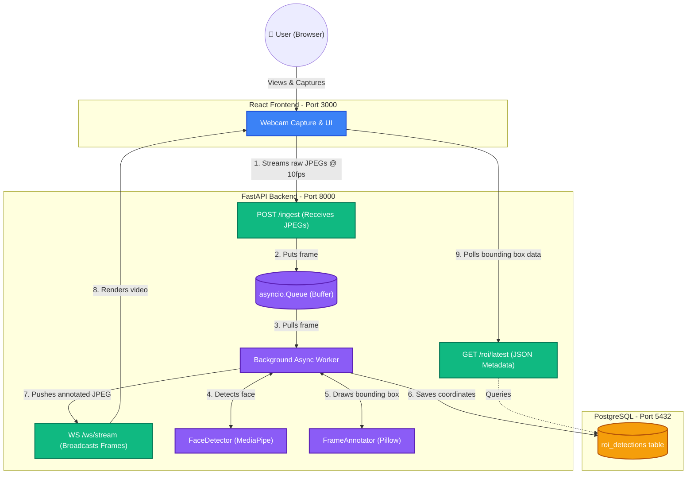

# FaceStream

A real-time, containerized face detection video streaming application built with FastAPI, React, MediaPipe, and PostgreSQL.

## Architecture

This application follows a modern asynchronous streaming architecture.



## Getting Started ("Stranger in 5 mins" Setup)

### Prerequisites
- Docker & Docker Compose installed.

### 1. Launch the Stack
Start the PostgreSQL database, FastAPI backend, and React frontend all at once:
```bash
docker compose up -d --build
```

### 2. Verify Health
Ensure all containers are healthy:
```bash
docker compose ps
```

### 3. Open the Application
Navigate to [http://localhost:3000](http://localhost:3000) in your browser.
- Click **START STREAM**.
- Allow camera permissions when prompted.
- The system will immediately begin streaming, annotating, and logging face detections in real-time.

### 4. Stopping the Application
To gracefully shut down all services and clean up, run:
```bash
docker compose down
```

### Checking Logs (Optional)
If you need to debug or view the background worker logging:
```bash
docker compose logs -f backend
```

## Key Features & Constraints Met
- **No OpenCV**: MediaPipe and Pillow are used exclusively for detection and bounding box drawing.
- **Asynchronous Architecture**: FastAPI handles HTTP and WebSockets asynchronously using a background worker pattern to prevent blocking the event loop with CPU-bound computer vision tasks.
- **PostgreSQL Persistence**: Detection coordinates and confidence scores are securely saved with explicit constraints.
- **Real-time UX**: The frontend provides an 'Editorial Utility' dynamic interface showing frame rate, detection logs, and real-time bounding box renders.

## AI Collaboration Attestation
In accordance with the assignment guidelines, AI tooling (an agentic coding assistant) was used to assist in the development of this project. 
- **Where**: The AI assistant collaborated on scaffolding the FastAPI backend layout, constructing the multi-stage Dockerfiles, implementing the Pillow annotation logic, writing the Pytest skeletons, and generating the Mermaid architecture diagram.
- **How**: Development was conducted via pair-programming. The developer guided architectural decisions (like enforcing `asyncio.Queue` backpressure and avoiding OpenCV for drawing), reviewed the generated code for security/pragmatism, handled local testing, and orchestrated the integration of the React frontend with the FastAPI backend.
